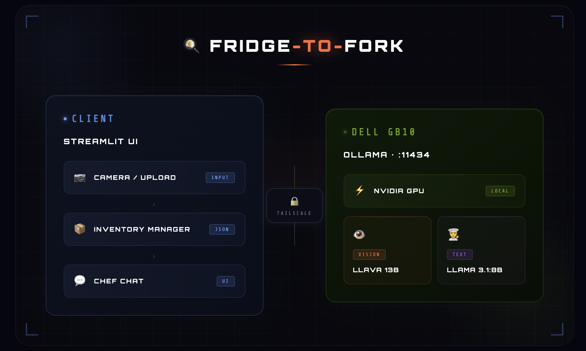

# 🍳 Fridge-to-Fork


---


**↑ Snap your fridge → Get a recipe in seconds**

---

Snap your fridge. Chat with your personal AI chef. **100% local** — no cloud, no API keys.

---

## Architecture



---

## Features

| | |
|---|---|
| 📷 | Photo upload or live camera |
| 🔍 | Local AI ingredient detection |
| 💬 | Chat with AI chef |
| 📦 | Persistent fridge inventory |
| 🔒 | 100% private, runs on-device |

---

## Tech Stack

| Layer | Technology |
|-------|------------|
| Frontend | Streamlit |
| Vision Model | LLaVA 13b |
| Recipe Model | LLaMA 3.1:8b |
| Model Server | Ollama |
| Networking | Tailscale |
| Hardware | Dell Pro Max with GB10 |

---

## Quick Start

**Prerequisites:** Ollama, Python 3.11, Tailscale (for Mac ↔ GB10)

```bash
git clone https://github.com/Jeremy891102/fridge-to-fork.git
cd fridge-to-fork
cp .env.example .env
pip install -r requirements.txt
streamlit run client.py
```

---

## .env Setup

Create `.env` from the example and set your GB10 host (Tailscale IP or hostname):

```env
GB10_IP=your_ip_here
OLLAMA_PORT=11434
MODEL=llava:13b
CHAT_MODEL=llama3.1:8b
```

---

## Project Structure

```
fridge-to-fork/
├── client.py           # Streamlit frontend (run this)
├── app.py              # Alternate Streamlit entry
├── core/
│   ├── vision.py       # Ingredient detection (LLaVA)
│   └── recipe.py       # Recipe generation & chat (LLaMA)
├── utils/
│   └── ollama_client.py # Ollama API client
├── scripts/
│   └── test_ollama.py  # Connection test script
├── .env.example        # Env template
├── requirements.txt    # Python deps
└── README.md
```

---

## Built at

**Dell x NVIDIA x NYU Hackathon** — February 2025
